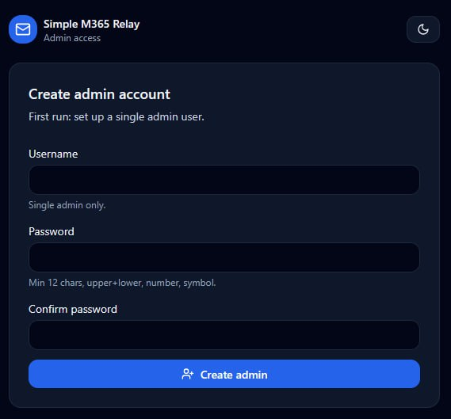
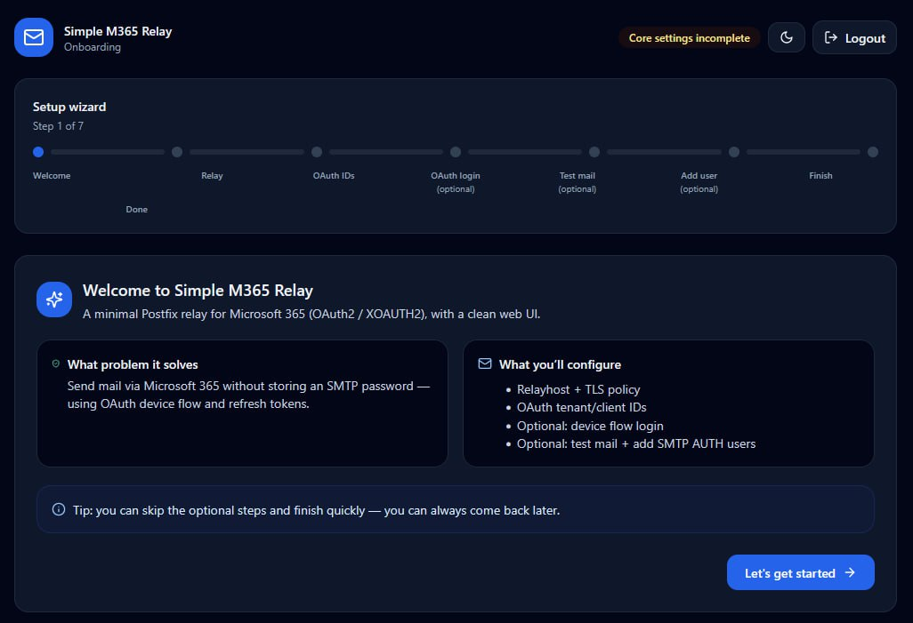
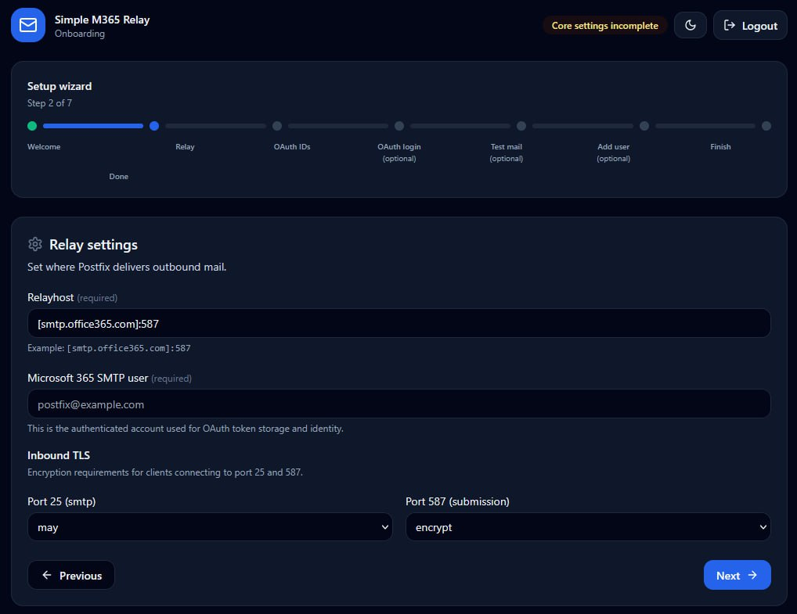
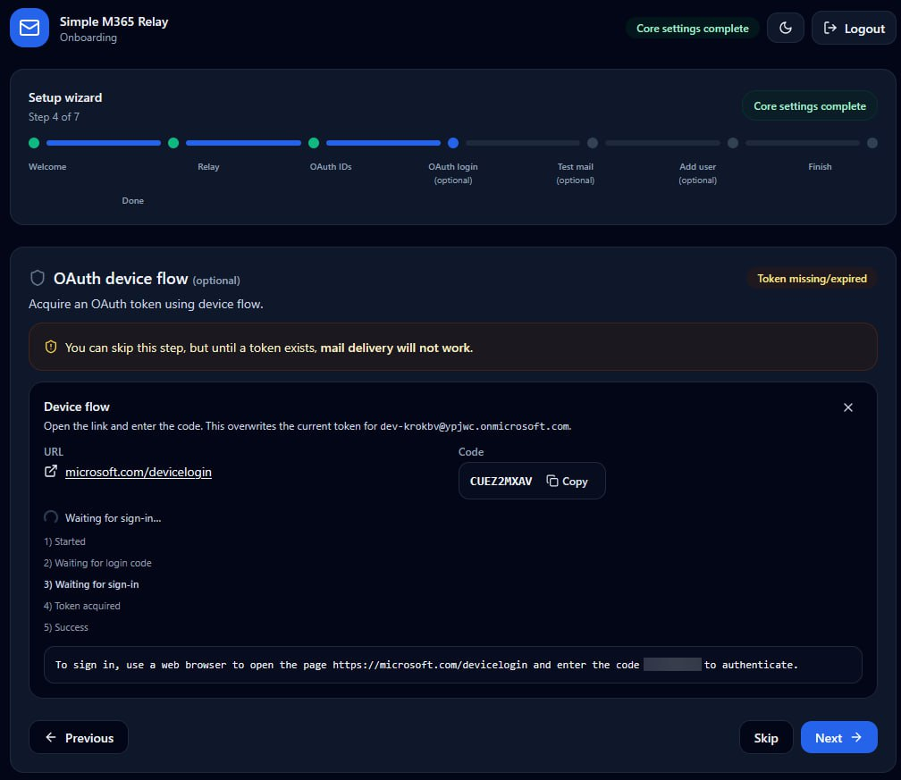
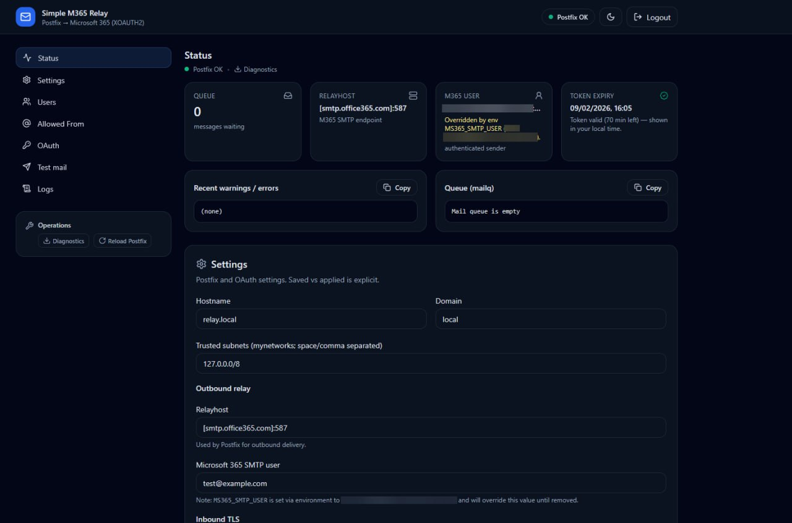

# Simple M365 Relay (Postfix → Microsoft 365 via OAuth2 / XOAUTH2) ✉️

Reusable Docker Compose stack that:

- Listens on **25** and **587** (submission)
- Accepts client mail with **SMTP AUTH** (Cyrus SASL `sasldb2`) and/or **trusted subnets** (`mynetworks`)
- Relays outbound mail via **smtp.office365.com:587** using **XOAUTH2** (`sasl-xoauth2`)
- Includes a web UI (FastAPI) for status + settings + OAuth device flow + user management
- Persists configuration, SMTP AUTH DB, and OAuth tokens in a Docker volume 💾

This is based on the approach described here:
- https://std.rocks/relay-ms365-oauth.html

---

## Disclaimer ⚠️

This project was largely written with the help of an AI assistant.
Use it at your own risk.

- No warranties are provided.
- Review the code and security posture before using in production.
- Do not expose the relay/UI to the public internet unless you know what you are doing.

---

## Screenshots 📸

**First-run setup:** create the single admin user.



**Onboarding wizard:** guided setup flow.



**Relay settings:** configure relayhost + (currently) the M365 SMTP user.



**OAuth device flow:** acquire a token via device login.



**Dashboard:** status overview + settings.



---

## Quick start 🚀

### Option A: Run from source (build locally)

```bash
git clone https://github.com/LickABrick/simple-m365-relay.git
cd simple-m365-relay
cp env.example .env
# edit .env

docker compose up -d --build
```

Web UI:
- http://localhost:8000/

### Option B: Run from GHCR images (no local build)

Create a minimal `docker-compose.yml` (adjust ports/volume as you like):

```yaml
services:
  postfix:
    image: ghcr.io/lickabrick/simple-m365-relay-postfix:latest
    container_name: simple-m365-relay-postfix
    restart: unless-stopped
    ports:
      - "25:25"
      - "587:587"
    environment:
      # Currently required for token storage/identity:

      MS365_SMTP_USER: "postfix@example.com"
    volumes:
      - simple-m365-relay-data:/data

  ui:
    image: ghcr.io/lickabrick/simple-m365-relay-ui:latest
    container_name: simple-m365-relay-ui
    restart: unless-stopped
    ports:
      - "8000:8000"
    environment:
      # Recommended: use TCP within the Docker network

      POSTFIX_CONTROL_URL: http://postfix:18080
      DATA_DIR: /data
    volumes:
      - simple-m365-relay-data:/data
    depends_on:
      - postfix

volumes:
  simple-m365-relay-data: {}
```

Then run:

```bash
docker compose up -d
```

Open the UI and complete `/setup` + `/onboarding`.

> Note: The images are published by GitHub Actions on **GitHub Releases** (not on every push). Use `:<version>` tags for releases (and `:sha-<shortsha>` for traceability).

### First login 🔐

The UI includes built-in authentication:

1. Open the UI → you will be redirected to **/setup**.
2. Create the single **admin** user.
3. You may then be redirected into **/onboarding** (wizard).

---

## Microsoft 365 / Entra prerequisites (high-level)

1. Create a **licensed** M365 user that will send mail (e.g. `postfix@…`).
2. Enable **Authenticated SMTP** for that mailbox/user.
3. Register an Entra application (no client secret required).
4. Enable **Public client flows** (device code flow).
5. Put values into `.env` (or via UI config):
   - `MS365_SMTP_USER`
   - `MS365_TENANT_ID`
   - `MS365_CLIENT_ID`

> Exact permission/scopes setup depends on your org policy and Microsoft changes. The UI’s OAuth section + logs are the ground truth for whether token acquisition/refresh works.

---

## OAuth device flow (mint / replace token) 🔑

You can do this from:
- **Onboarding → OAuth device flow step**, or
- Dashboard → **OAuth** section (step-based re-auth wizard)

Flow:

1. Click **Re-auth wizard** / **Restart device flow**.
2. Open the URL (usually `https://microsoft.com/devicelogin`) and enter the code.
3. Complete login as the configured `MS365_SMTP_USER`.
4. Verify token status/expiry in the UI.

Token files are persisted in the Docker volume:
- `/data/tokens/<safe-filename-derived-from-MS365_SMTP_USER>`

### Token expiry source

For least privilege, the UI container does **not** read the token file directly (token files are `600 postfix:postfix`).
Instead, the UI asks the internal Postfix control API for token expiry.

---

## Client configuration

### Port 587 (recommended)
- Use STARTTLS
- SMTP AUTH required

### Port 25
- Opportunistic TLS (default)
- Relaying allowed for:
  - `mynetworks` (trusted subnets), or
  - SMTP AUTH users

---

## UI capabilities ✨

- **Manage SMTP AUTH users** (adds/removes entries in `sasldb2`)
- Configure:
  - `hostname`, `domain`
  - `mynetworks` (trusted subnets)
  - allowed envelope-from addresses per authenticated login (sender login maps)
  - per-user “fallback From” (used when clients don’t specify a From)
- Start OAuth device flow, view logs, verify token expiry
- Show:
  - queue size
  - tail of Postfix mail log (redacted)
  - token expiry
  - token refresh “Last refresh” timestamp
- Apply workflow:
  - **Save** settings without touching Postfix
  - **Apply Changes** to render config + reload Postfix

---

## CLI (run inside the UI container) 🧰

Break-glass / scripting helpers that you run via `docker exec`.

Examples:

```bash
# Show relay/token/admin status
docker exec -it simple-m365-relay-ui /opt/venv/bin/python -m app.cli status

# Apply saved config (render + reload postfix)
docker exec -it simple-m365-relay-ui /opt/venv/bin/python -m app.cli apply

# Reset the admin account (forces /setup on next visit)
docker exec -it simple-m365-relay-ui /opt/venv/bin/python -m app.cli admin reset

# Non-interactive
docker exec -it simple-m365-relay-ui /opt/venv/bin/python -m app.cli admin reset --yes
```

Admin reset details:
- deletes `/data/state/auth.json`
- deletes `/data/state/secret.key` (invalidates all sessions)
- deletes `/data/state/lockout.json`
- optional: `--wipe-config` and/or `--wipe-state`

---

## Volumes / persistence 💾

A single named volume is used:

- `/data/config/config.json` (UI settings)
- `/data/sasl/sasldb2` (SMTP AUTH user DB)
- `/data/tokens/` (OAuth token files)
- `/data/certs/` (TLS cert/key; self-signed by default)
- `/data/state/` (UI/app state + logs)

The compose file preserves the underlying Docker volume name:
- `ms365-relay_ms365-relay-data`

---

## TLS certificates 🔒

By default the container generates a **self-signed** cert at first start.

To use your own cert, mount/replace the files in the volume and set:

- `RELAY_TLS_CERT_PATH=/data/certs/tls.crt`
- `RELAY_TLS_KEY_PATH=/data/certs/tls.key`

(Those are the defaults.)

---

## Security notes (important) 🛡️

- **Protect the web UI**: it can manage SMTP AUTH users, From rules, and OAuth (device flow).
- The relay is intended for **internal / trusted** networks.
  - Do not expose port 25/587 publicly unless you know what you are doing.
- The Postfix control API is designed to be **internal-only**:
  - preferred transport is a **unix socket** on the shared volume (`/data/state/control.sock`)
  - requests are authenticated with a shared token (`X-Control-Token`)
- Supply-chain hardening:
  - Tailwind is built at image build time and served from `/static/tailwind.css`
  - Lucide is vendored and served from `/static/lucide.min.js`
- OAuth tokens are bearer credentials.
  - Restrict access to the Docker host and the Docker volume.

---

## Troubleshooting 🧯

- Check UI “Mail log (tail)” for errors.
- Queue inspection:
  ```bash
  docker exec -it simple-m365-relay-postfix mailq
  ```
- Reload Postfix (keeps current config):
  ```bash
  docker exec -it simple-m365-relay-postfix postfix reload
  ```
