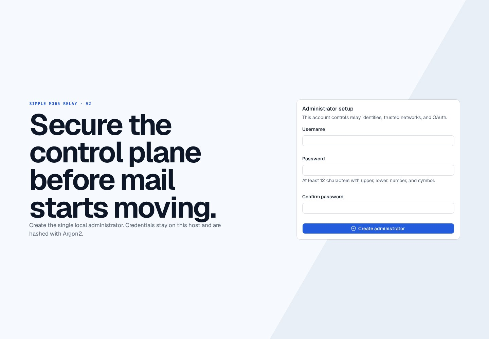
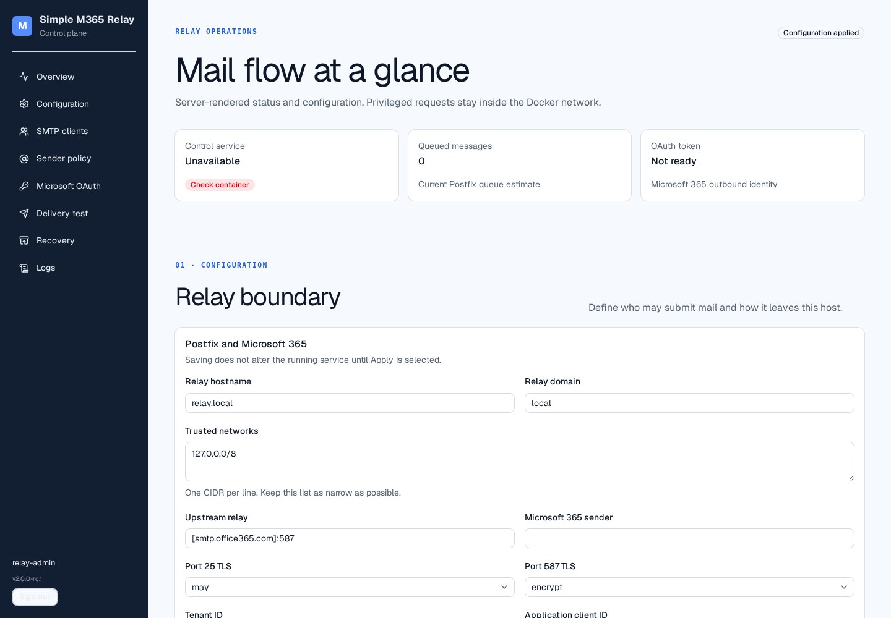
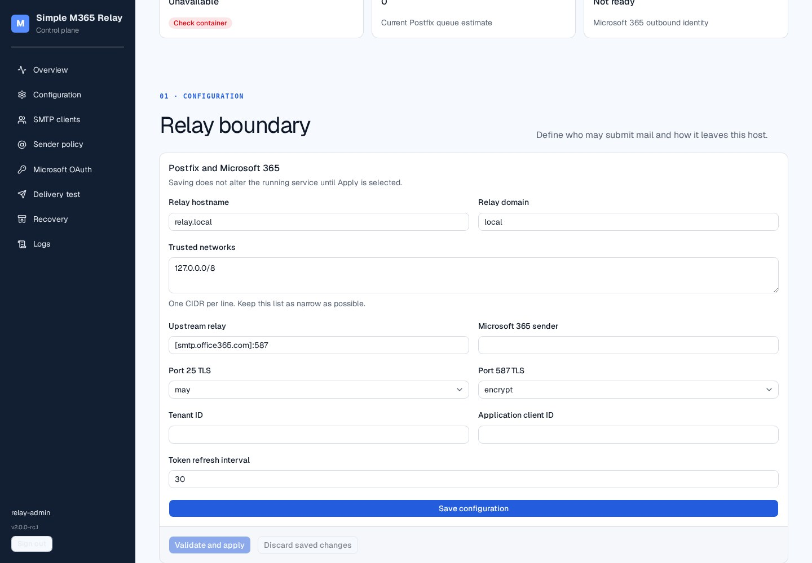
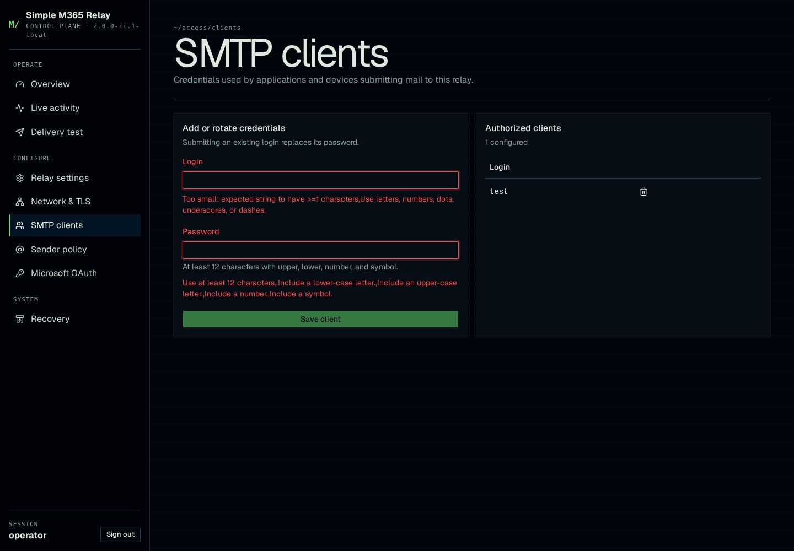
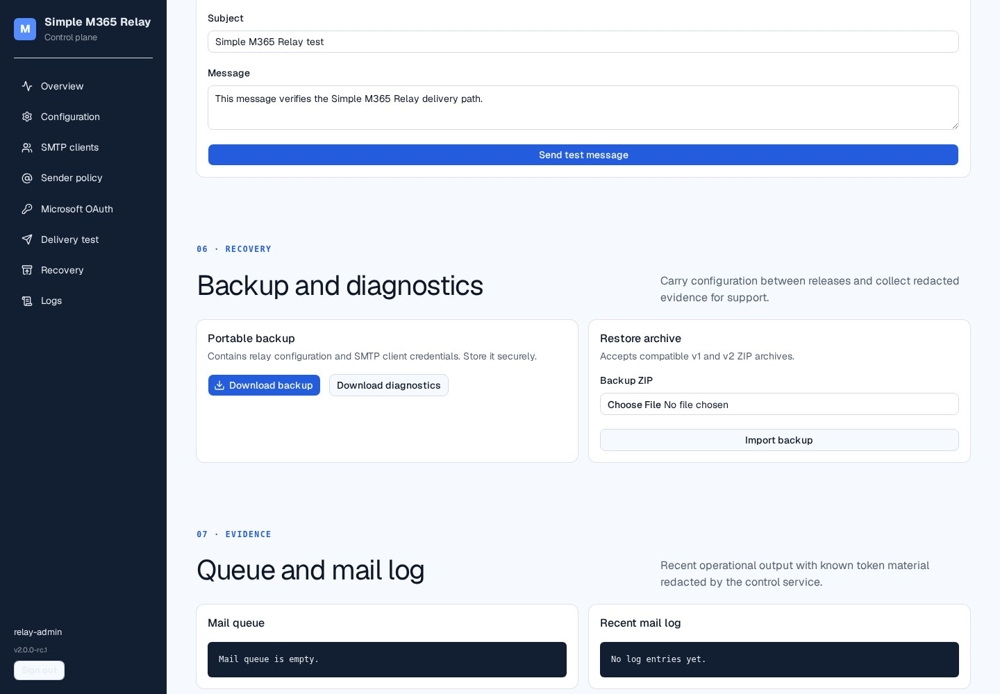

# Simple M365 Relay

A self-hosted Postfix relay that sends through Microsoft 365 using OAuth2/XOAUTH2. The v2 control plane is a server-rendered SvelteKit application: browsers talk only to SvelteKit, and SvelteKit talks to the private Postfix control service over the Compose network.

## What it provides

- SMTP on ports 25 and 587 with Dovecot-backed SMTP AUTH
- Microsoft 365 OAuth device authorization and token refresh
- Trusted-network, SMTP-client, allowed-sender, and default-sender management
- Save, validate, and apply workflow for Postfix configuration
- Queue, mail-log, token, backup, restore, and redacted diagnostics tools
- SQLite persistence with ordered Drizzle migrations
- Server-enhanced forms with client-side Zod validation

## Screenshots











## Quick start

```bash
git clone https://github.com/LickABrick/simple-m365-relay.git
cd simple-m365-relay
cp env.example .env
docker compose up -d --build
```

Open `http://localhost:8000/setup`, create the local administrator, then configure the relay from the dashboard. The source Compose configuration binds the UI to `127.0.0.1` by default.

For an HTTPS reverse proxy, set `ORIGIN=https://relay.example.com` on the UI service. Do not expose the Postfix control port; it is intended only for the private Compose network.

### Local UI development

```bash
npm install
npm run dev
```

Development state is written to `apps/web/.data`, not `/data`, so an ordinary user can run Vite without elevated permissions. Override this with `DATA_DIR` when required.

## Persistent data and v1 upgrade

The canonical application database is `/data/state/relay.db`. Drizzle migrations run automatically before requests are served. SQLite uses WAL mode, foreign keys, a busy timeout, and owner-only file permissions.

On the first v2 start:

1. Existing `/data/state/auth.json` administrator credentials are imported when the administrators table is empty.
2. Existing `/data/config/config.json` settings are imported when the settings table is empty.
3. The source files are not deleted automatically, so rollback remains possible.
4. Every later start logs a warning while legacy `config.json` remains. After verifying v2, it can be deleted because Postfix and the UI both read SQLite.

Back up the volume before upgrading. Backup ZIPs remain a portable interchange format and support v1 and v2 configuration archives; they intentionally exclude the UI administrator and OAuth tokens. SMTP client credentials in an exported archive are sensitive.

## Microsoft 365 prerequisites

1. Create a licensed sending mailbox and enable Authenticated SMTP for it.
2. Register an Entra application without a client secret.
3. Enable public client/device-code flows.
4. Enter the mailbox, tenant ID, and client ID in the UI.
5. Start device authorization, complete the Microsoft prompt, and check token status.

Microsoft tenant policy can prevent SMTP AUTH or device flow even when the relay is configured correctly. The OAuth progress and mail log sections provide the relevant operational evidence.

## Client configuration

- Port 587 is recommended and requires STARTTLS plus SMTP AUTH.
- Port 25 defaults to opportunistic TLS and permits relaying only for narrowly configured trusted networks or authenticated clients.
- Use sender policies to restrict each login's permitted envelope-from identities.

## Security notes

- Keep the UI behind an authenticated TLS reverse proxy for remote access.
- Keep `mynetworks` narrow; broad CIDRs can create an open relay.
- Protect `/data`, exported backups, SMTP credentials, and OAuth tokens as secrets.
- The UI session is HTTP-only, SameSite Strict, signed, and can be forced secure with `FORCE_SECURE_COOKIES=1`.
- The UI image prepares its state directory as root and then runs Node as UID/GID 10001.

See [the v2 audit](docs/AUDIT-V2.md) for findings, mitigations, residual risks, and verification evidence.

## Health and operations

`GET`, `HEAD`, or `OPTIONS` on `/healthz` returns `200` when the UI and database initialization are available. Use the dashboard for apply, token, backup, restore, diagnostics, test-mail, queue, and log operations.

## Release policy

The SvelteKit/SQLite rewrite is versioned `2.0.0` because it changes the UI runtime, persistence format, container behavior, and upgrade path. Release candidates use `2.0.0-rc.N` from an `rc/v2.0.0-rc.N` branch.

## Disclaimer

This project was built with assistance from AI tooling. It is provided without warranty. Review the configuration and security posture for your environment before production use.
