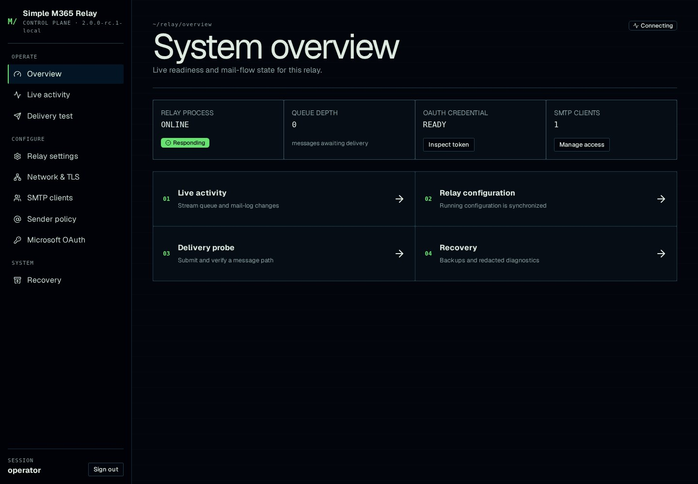
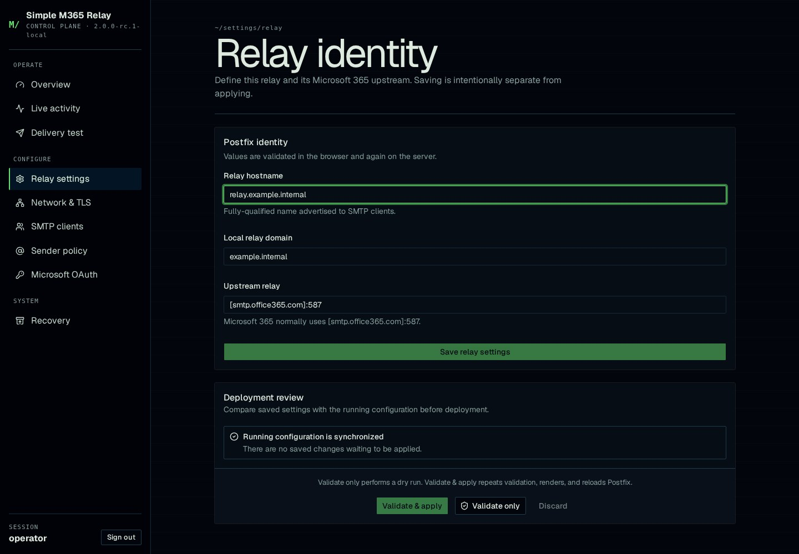
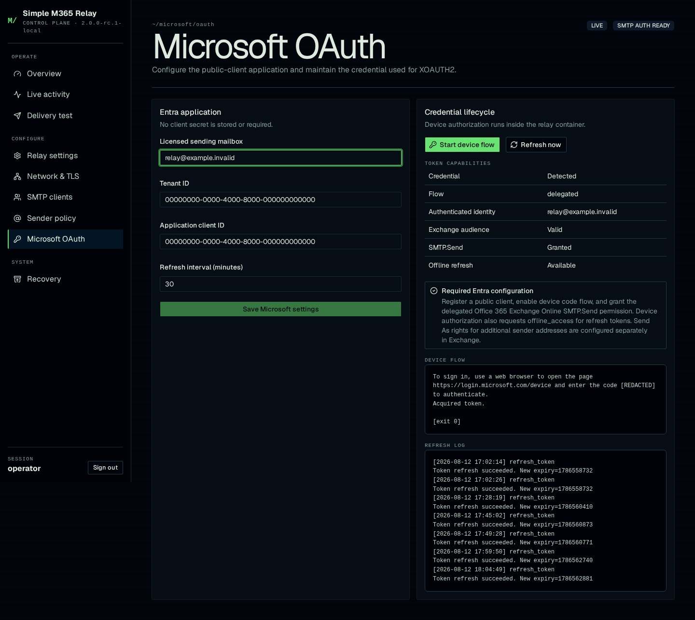
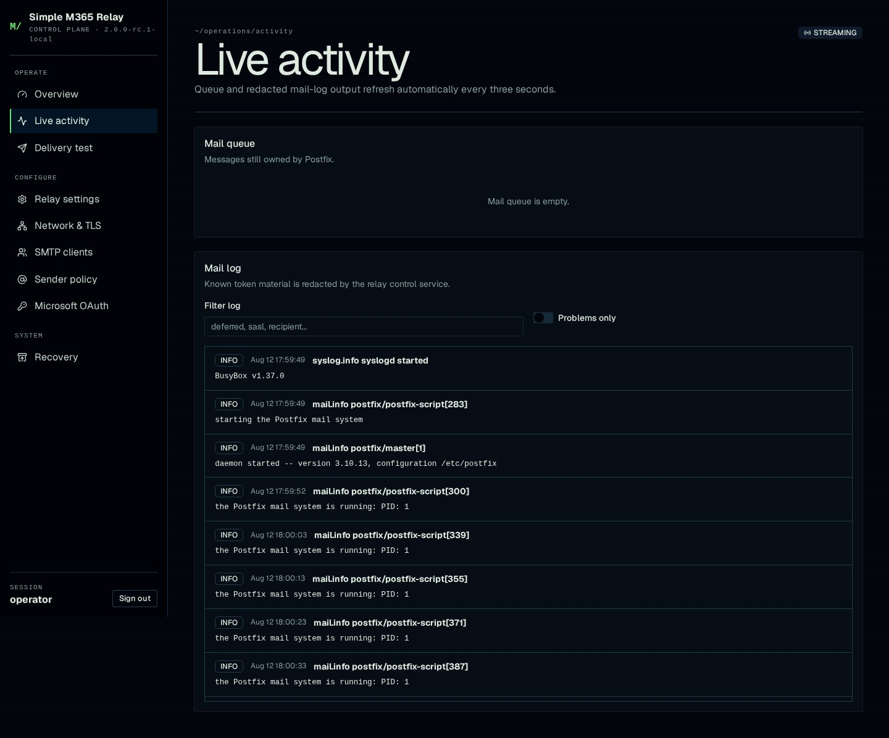

# Simple M365 Relay

Simple M365 Relay is a containerized Postfix relay for applications, scanners, and devices that need to submit mail to Microsoft 365. Local clients use SMTP; Postfix sends upstream through Exchange Online SMTP AUTH with OAuth 2.0 (`XOAUTH2`). The administration plane is a server-rendered SvelteKit application.

> Version 2 is a major control-plane and persistence rewrite. Read [Upgrading from v1](#upgrading-from-v1) before replacing an existing deployment.

## What it provides

- SMTP listeners on ports 25 and 587.
- Dovecot-backed SMTP AUTH users and trusted-network relay rules.
- Per-client allowed-envelope-sender and default-sender policies.
- Exchange Online delivery through `smtp.office365.com:587` using OAuth/XOAUTH2.
- Guided readiness and onboarding checks for configuration, users, senders, and tokens.
- Live queue, structured mail-log diagnostics, delivery testing, and operational alerts.
- A save → review diff → validate & apply deployment workflow.
- SQLite configuration and administrator storage with automatic Drizzle migrations.
- Portable configuration/client backups and redacted diagnostic bundles.

The relay uses modern authentication over SMTP AUTH; it does not send through Microsoft Graph. SMTP AUTH must be enabled for the configured Exchange Online mailbox even when OAuth is used.

## Screenshots

The screenshots below show a configured instance with tenant identifiers, addresses, hostnames, and public IPs replaced in the browser before capture.

### Operations overview



### Review, validate, and apply



### Microsoft OAuth readiness



### Live queue and mail logs



Additional configured views: [Network & TLS](docs/screenshots/03-network-tls.jpg), [SMTP clients](docs/screenshots/04-smtp-clients.jpg), [Sender policy](docs/screenshots/05-sender-policy.jpg), and [Recovery](docs/screenshots/08-recovery.jpg).

## Quick start

### Build from source

```bash
git clone https://github.com/LickABrick/simple-m365-relay.git
cd simple-m365-relay
cp env.example .env
docker compose up -d --build
```

Open <http://localhost:8000>, create the single administrator, and follow onboarding. The UI binds to loopback by default. Put it behind an authenticated HTTPS reverse proxy for remote access; do not expose it directly to the internet.

### Use published images

```yaml
services:
  postfix:
    image: ghcr.io/lickabrick/simple-m365-relay-postfix:2.0.0-rc.2
    container_name: simple-m365-relay-postfix
    restart: unless-stopped
    ports:
      - "25:25"
      - "587:587"
    security_opt:
      - no-new-privileges:true
    environment:
      CONTROL_BIND: 0.0.0.0
      CONTROL_PORT: "18080"
      RELAY_TLS_GENERATE_SELF_SIGNED: "true"
    volumes:
      - simple-m365-relay-data:/data
    expose:
      - "18080"

  ui:
    image: ghcr.io/lickabrick/simple-m365-relay-ui:2.0.0-rc.2
    container_name: simple-m365-relay-ui
    restart: unless-stopped
    ports:
      - "127.0.0.1:8000:8000"
    security_opt:
      - no-new-privileges:true
    read_only: true
    tmpfs:
      - /tmp
    environment:
      ORIGIN: http://localhost:8000
      POSTFIX_CONTROL_URL: http://postfix:18080
      DATA_DIR: /data
    volumes:
      - simple-m365-relay-data:/data
    depends_on:
      postfix:
        condition: service_started

volumes:
  simple-m365-relay-data: {}
```

Pre-releases do not update the `latest` image tag. Pin both containers to the same explicit release version.

## Microsoft 365 prerequisites

1. Create or choose a licensed Exchange Online mailbox for relay authentication.
2. Enable **Authenticated SMTP** for that mailbox. The recommended posture is to leave SMTP AUTH disabled tenant-wide and override it only for the relay mailbox:

   ```powershell
   Set-CASMailbox -Identity relay@example.com -SmtpClientAuthenticationDisabled $false
   ```

3. Register a Microsoft Entra application.
4. Enable public-client/device-code flows; no client secret is required.
5. Grant delegated `https://outlook.office.com/SMTP.Send` and `offline_access` consent.
6. Configure the mailbox, tenant ID, and application client ID in the UI.
7. Complete the device flow as the sending identity.
8. Grant Exchange **Send As** rights when configured sender addresses differ from the authenticated mailbox.

The Microsoft OAuth page safely reports token type, audience, SMTP scope, refresh capability, expiry, configuration mismatch, and sender-permission guidance. It never displays access or refresh token material.

## Client connection profiles

### Port 587—recommended for authenticated clients

- STARTTLS required by the default policy.
- SMTP AUTH required.
- Use a client created under **SMTP clients**.

### Port 25—trusted network relay

- Opportunistic STARTTLS by default.
- Relaying is permitted only for configured trusted networks or authenticated users.
- Avoid publishing this port to untrusted networks.

Example PowerShell submission:

```powershell
Send-MailMessage -SmtpServer relay.example.internal -Port 587 -UseSsl -Credential (Get-Credential) -From sender@example.com -To recipient@example.com -Subject "Relay test" -Body "Test message"
```

`Send-MailMessage` is obsolete, but remains useful for a quick controlled test. Certificate validation will fail when connecting by an address that does not match the relay certificate, or when using the generated self-signed certificate without trusting it.

## Configuration lifecycle

Configuration edits are saved to SQLite but do not immediately alter Postfix:

1. Save settings on the relevant route.
2. Open **Relay settings → Deployment review** (or **Review changes** in the sidebar).
3. Inspect the git-style diff between the saved and running configuration.
4. Optionally run **Validate only** for a dry run.
5. Select **Validate & apply**. The relay validates, renders, reloads Postfix, and records the applied snapshot.

If validation fails, the running configuration is retained. **Discard** restores the last applied configuration snapshot.

## Persistence and migrations

The shared `/data` volume contains:

- `/data/state/relay.db`—SQLite settings, applied snapshot, and administrator.
- `/data/state/secret.key`—session-signing key.
- `/data/state/control.token`—UI-to-relay API credential when not supplied by environment.
- `/data/sasl/users`—Dovecot SMTP client password file.
- `/data/tokens/`—OAuth token files, owned by Postfix.
- `/data/certs/`—relay TLS certificate and key.
- `/data/log/maillog`—persistent Postfix mail log.

The UI runs all bundled Drizzle migrations automatically before serving requests. Back up the volume before upgrading and never run two UI versions against the same database simultaneously.

Environment configuration values bootstrap a new database; they do not continuously override saved UI values. `DATABASE_URL` and `DATA_DIR` still determine storage locations at runtime.

## Upgrading from v1

1. Stop the v1 stack and back up its Docker volume.
2. Update both images/containers together.
3. Keep the same volume mounted at `/data`.
4. Start the v2 UI and relay.
5. The first UI startup creates and migrates `/data/state/relay.db`.
6. If `/data/config/config.json` exists and SQLite has no settings row, it is imported automatically.
7. Confirm the imported values and complete the new readiness/onboarding checks.
8. Review and apply the generated configuration.
9. After verification, delete the legacy `config.json`. While it remains, startup logs warn that it is no longer used.

Legacy administrator state and compatible backup archives are also imported. Existing OAuth tokens and Dovecot users remain in their established volume paths.

Because the UI, sessions, persistence, and deployment workflow changed substantially, this release is versioned as 2.0 rather than a 1.x feature increment.

## Backup and recovery

The **Recovery** route provides:

- A portable ZIP containing configuration and SMTP client credentials.
- Import for compatible v1/v2 backup ZIPs, with path and size validation.
- A redacted diagnostics download containing configuration, health, token metadata, queue, and recent logs.
- A Postfix reload action that does not save pending UI changes.

Backups exclude the UI administrator and OAuth tokens. They contain SMTP client password hashes and must still be stored as secrets.

## Administration CLI

The UI image contains a small break-glass CLI:

```bash
# Report database/admin/applied-state metadata
docker exec simple-m365-relay-ui node /opt/ms365-relay/admin-cli.mjs status

# Remove the administrator and invalidate sessions; /setup is shown next
docker exec simple-m365-relay-ui node /opt/ms365-relay/admin-cli.mjs admin reset --yes
```

The CLI does not apply relay configuration; use the reviewed UI workflow or the authenticated internal control API.

## Security model

- The control plane has one administrator and rate-limited login attempts.
- Sessions are signed, HTTP-only, SameSite=Strict cookies with CSRF protection on mutations.
- The production UI runs non-root with a read-only root filesystem and dropped capabilities after volume initialization.
- The relay control API is internal-only and authenticated by a shared token.
- Browser security headers include CSP, `nosniff`, a same-origin referrer policy, and a restrictive permissions policy.
- OAuth and mail-log output are redacted before reaching the UI.
- Form values are validated in the browser and again on the server.
- Backup extraction uses an allowlist and archive size limits.

Protect the Docker host, `/data` volume, SMTP ports, and control-plane URL. Review generated Postfix configuration and organizational Exchange policies before production use.

## Health and troubleshooting

- UI health: `GET /healthz`
- Container state: `docker compose ps`
- Queue: `docker exec simple-m365-relay-postfix mailq`
- Persistent log: `docker exec simple-m365-relay-postfix tail -n 100 /data/log/maillog`
- Postfix validation: `docker exec simple-m365-relay-postfix postfix check`

The **Overview** surfaces active queue/log problems. **Live activity** updates the queue and redacted mail log every three seconds and formats known Exchange Online failures with remediation guidance.

Common Exchange errors:

- `Relay access denied`—the client is neither authenticated nor in a trusted network, or its sender policy rejects the envelope address.
- `535 5.7.139 SmtpClientAuthentication is disabled`—enable Authenticated SMTP for the Exchange Online relay mailbox.
- `535 5.7.3 Authentication unsuccessful`—check OAuth readiness, mailbox identity, tenant/client IDs, SMTP scope, and Exchange permissions.

## Development

```bash
npm install
npm run check
npm test
npm run build
python -m pytest
docker compose config --quiet
```

The Docker end-to-end suites are documented in [tests/e2e/README.md](tests/e2e/README.md). The SvelteKit application details are in [apps/web/README.md](apps/web/README.md).

## Disclaimer

This project has been developed substantially with AI assistance. It is provided without warranty. Review the implementation, generated configuration, dependencies, and security posture before production deployment.
